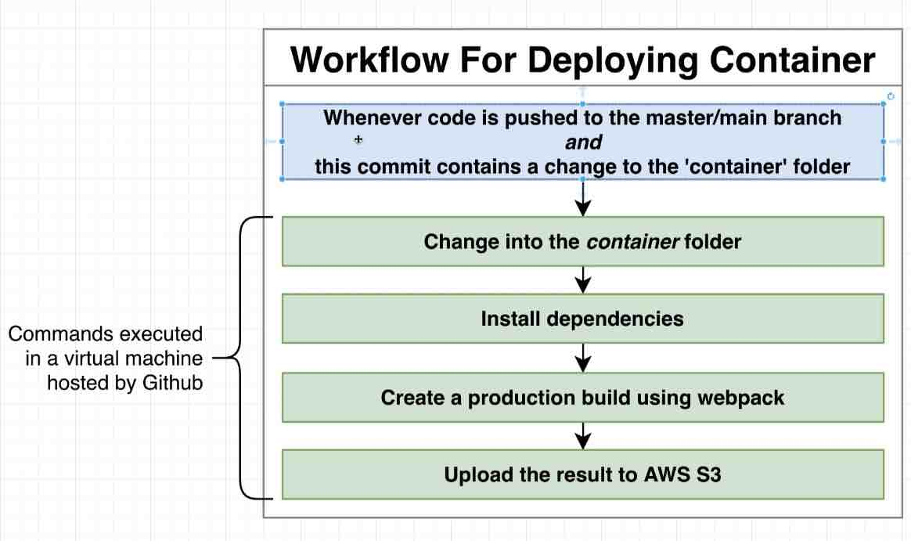
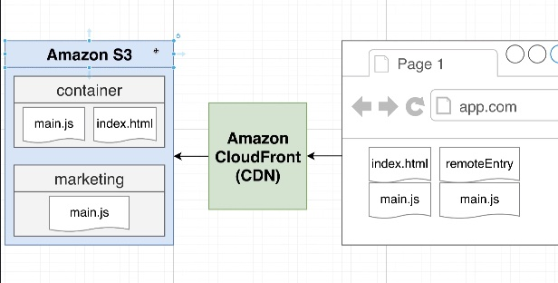

1. Build containers individual:
    docker-compose -f docker-compose.dev.yaml run container_dev npm run build

We are using GITHUB repo for event triggering in CI/CD pipelines. Run all workflows associated with it.
Events:
1. Push code
2. Create pull request
3. Every 15 mins
4. Create issue
5. Close issue
6. ...many others

https://d381c2ilh1p47i.cloudfront.net/

### CI/CD Setup
1.  CI/CD stps for container

2.  Deployment workflow in AWS

